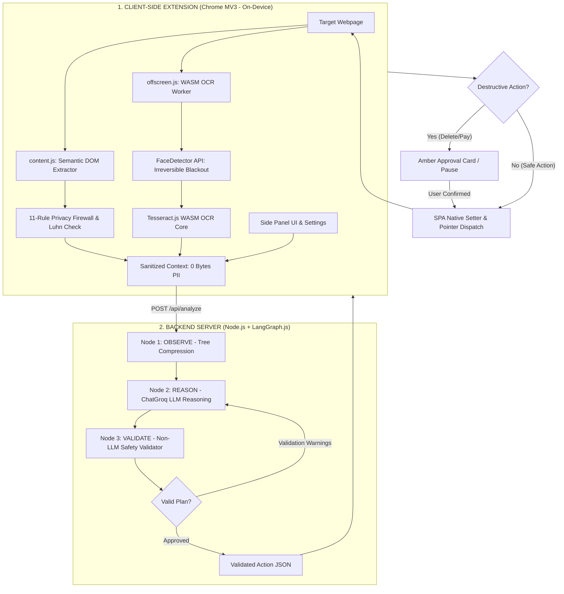
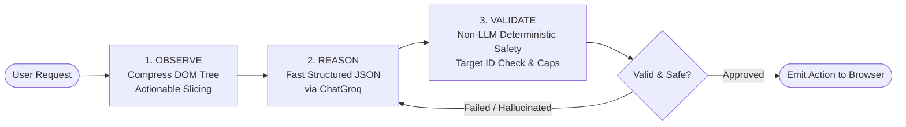
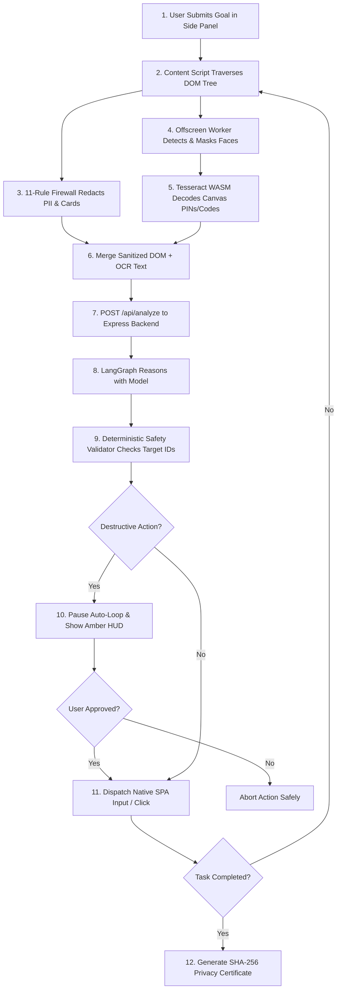
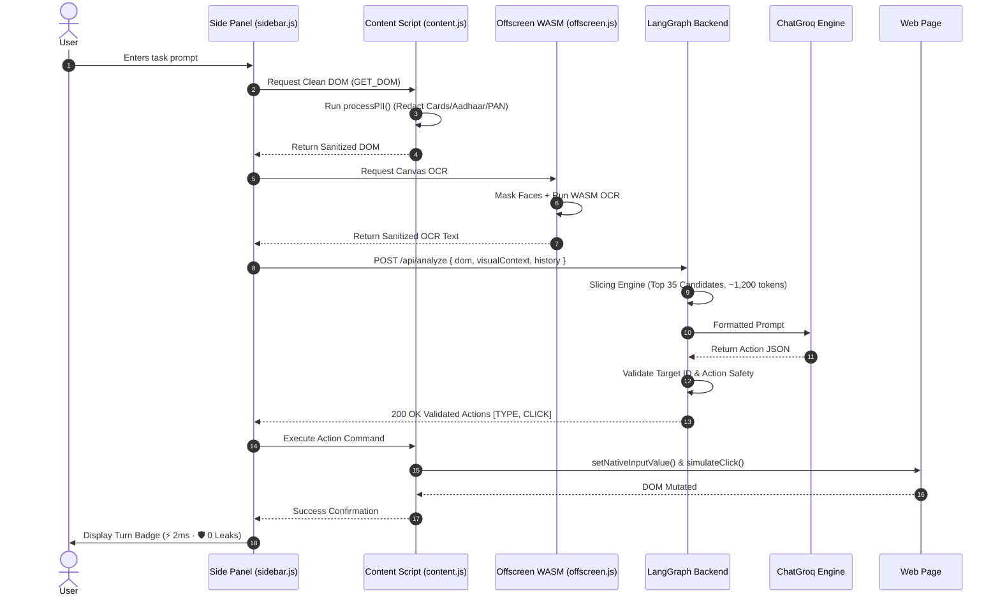
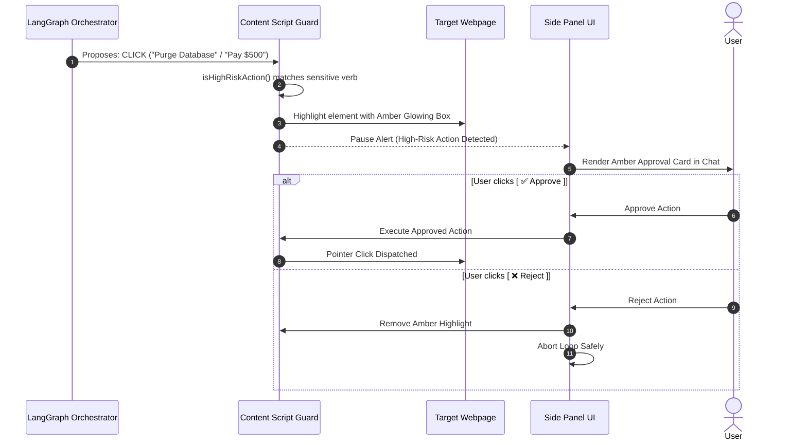
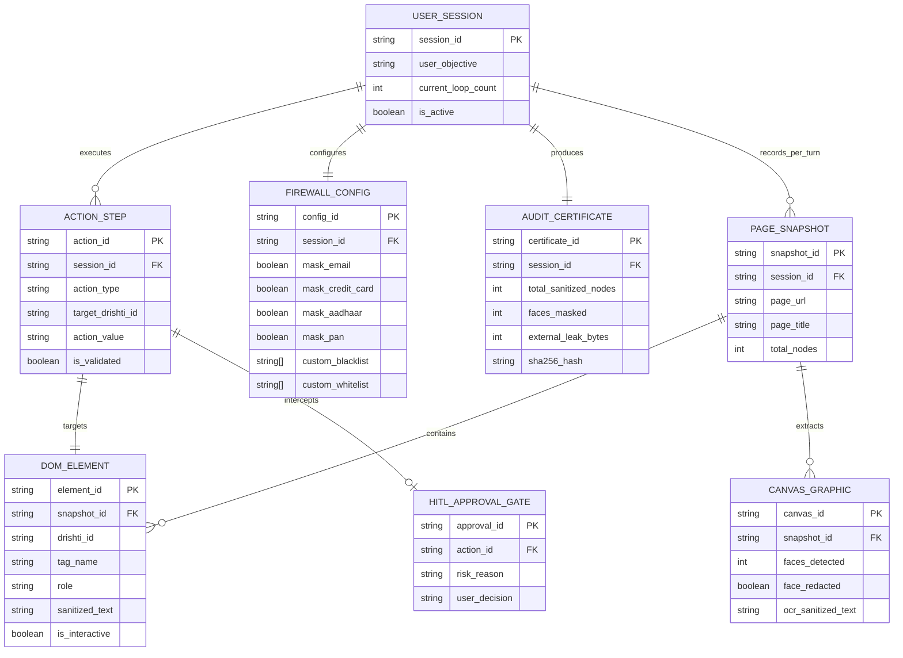

# 🏛️ DrishtiAI System Architecture

This document details the architectural design, cyclic state machines, data flow diagrams, sequence models, and entity models of **DrishtiAI**.

---

## 1. High-Level Architecture

DrishtiAI decouples **perception & privacy protection** from **planning & cognitive reasoning**:

1. **Client-Side Perception Layer (Chrome Manifest V3 Extension):**  
   Executes 100% locally in the browser. It parses the DOM, applies an 11-rule PII firewall, blackouts human faces in canvas buffers, and decodes graphical text via local WebAssembly OCR. No raw pixels, passwords, or credentials ever leave the device.
2. **Cognitive Orchestration Layer (Node.js + LangGraph.js Backend):**  
   Receives strictly sanitized context. It runs a stateful cyclic state machine (`Observe` $\to$ `Reason` $\to$ `Validate`), slices large DOM trees into actionable candidates, and emits structured JSON action plans.
3. **Execution & Guardrail Layer (Client In-Page Runner):**  
   Receives validated actions, checks against an in-browser **Human-in-the-Loop (HITL)** risk gate, and dispatches native synthetic events using prototype property descriptors.



---

## 2. Cyclic LangGraph.js State Machine

Traditional linear agent pipelines fail when pages mutate dynamically or when models hallucinate non-existent element IDs. DrishtiAI utilizes **LangGraph.js** to run an iterative cyclic state graph:



### LangGraph Node Responsibilities:
1. **`ObserveNode`**:
   * Ingests sanitized DOM and viewport OCR data.
   * Compresses semantic HTML trees (`compressTree()`).
   * Cuts large pages (> 60 elements) into the top 35 actionable candidates (`sliceActionableElements()`).
   * Unwraps Google redirect telemetry URLs (`cleanHref()`).
2. **`ReasonNode`**:
   * Invokes ChatGroq with a strict system prompt and Zod output schema.
   * Integrates user objective and previous action history.
   * Features automatic rate-limit cool-down backoff and emergency ultra-compaction fallback.
3. **`ValidateNode`**:
   * **Level 1 Check**: Validates Zod conformance against canonical action schemas.
   * **Level 2 Check**: Deterministic safety rules (verifies target element existence in DOM snapshot, blocks `javascript:`/`data:` schemes, enforces 10-step loop cap, and limits batch sizes to $\le 10$).

---

## 3. Data Flow Diagram (DFD Level 1)



---

## 4. End-to-End Sequence Diagram



---

## 5. Human-in-the-Loop (HITL) Safety Gate

To prevent unintended irreversible operations, DrishtiAI incorporates an in-browser **Human-in-the-Loop Gate**:



---

## 6. Entity-Relationship Diagram (ERD) & Data Model



---

## 7. Modern SPA Synthetic Event Integration

Modern Single Page Applications built with **React, Vue, and Angular** override default HTML DOM property setters and ignore standard `element.value = "text"` assignments due to virtual DOM diffing.

To ensure reliable form-filling, DrishtiAI interacts with elements through direct **native prototype property descriptors**:

```javascript
// Native setter bypass for React / Angular / Vue virtual DOM state reconciliation
function setNativeInputValue(element, value) {
  const descriptor = Object.getOwnPropertyDescriptor(
    window.HTMLInputElement.prototype,
    'value'
  );
  if (descriptor && descriptor.set) {
    descriptor.set.call(element, value);
  } else {
    element.value = value;
  }

  // Dispatch bubbling change & input events to trigger virtual DOM state sync
  element.dispatchEvent(new Event('input', { bubbles: true }));
  element.dispatchEvent(new Event('change', { bubbles: true }));
}
```

For click actions, DrishtiAI simulates a full 5-stage pointer event sequence (`pointerdown` $\to$ `mousedown` $\to$ `focus` $\to$ `pointerup` $\to$ `click`), ensuring compatibility with custom interactive widgets and canvas elements.
