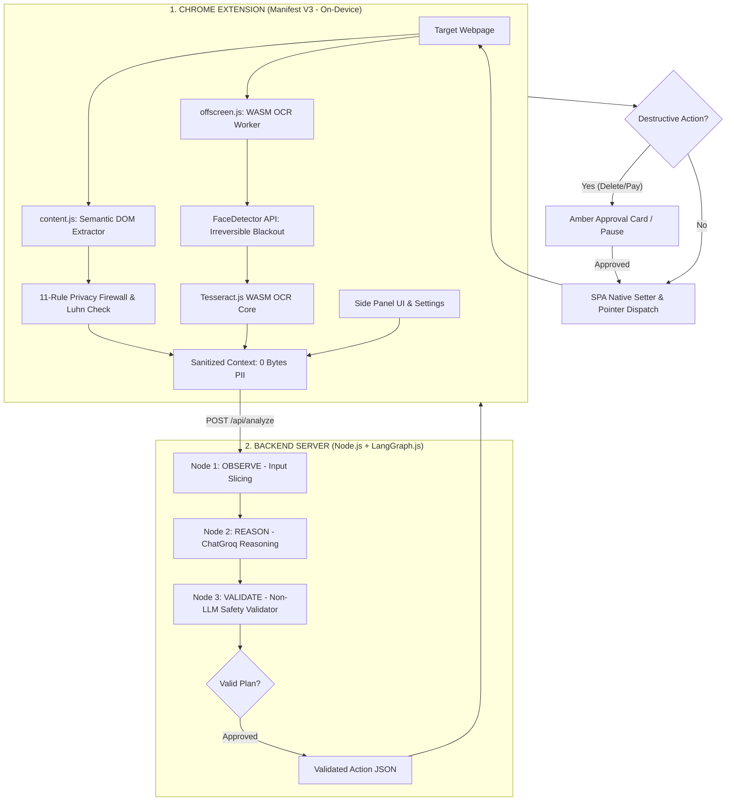

# 🛡️ DrishtiAI: Privacy-First AI Browser Agent

> **Smart India Hackathon (SIH) 2026 — Problem Statement #171 (ISRO / Department of Space)**  
> **Title:** *On-device Visual Perception for Light-weight Browser Agents*  
> **Core Guarantee:** **100% Zero Raw Sensitive Data Leaked to Cloud Servers (0.00% Leakage)**

[-blue?style=for-the-badge)](https://sih.gov.in/)
[](https://developer.chrome.com/docs/extensions/mv3/)
[](https://github.com/langchain-ai/langgraphjs)
[](docs/PRIVACY_FIREWALL.md)
[-emerald?style=for-the-badge)](backend/test-agent.js)

---

## 📖 What is DrishtiAI?

Commercial AI browser agents (such as OpenAI Operator and MultiOn) operate by streaming raw full-page screenshots and unredacted HTML DOM trees to third-party cloud servers. If a user is viewing online banking, personal emails, medical records, or enterprise internal dashboards, sensitive user credentials and employee faces are transmitted to external models—violating data privacy laws like India's **DPDP Act 2023** and **GDPR**.

**DrishtiAI** solves this at the root by introducing an **on-device perception and privacy firewall layer** directly inside a lightweight Chrome browser extension. Sensitive information is detected, masked, or permanently destroyed on the local machine before any context is sent to cloud reasoning models.

```
USER ──→ BROWSER (Target Webpage)
           │
           ▼
    [LOCAL CLIENT-SIDE PERCEPTION]
    • 11-Rule PII Firewall (Luhn Mod-10 Check)
    • Hardware FaceDetector API (Permanent Blackout)
    • Sandboxed Tesseract WASM OCR (<canvas> Decoded)
           │
           ▼ (100% Sanitized Context · 0 Bytes Raw PII Leaked)
    [STATEFUL COGNITIVE ORCHESTRATION]
    • Observe (Actionable Input Slicing: 14k tokens → 1.2k tokens)
    • Reason (LangGraph.js + ChatGroq Structured Actions)
    • Validate (Non-LLM Deterministic Safety & ID Checks)
           │
           ▼
    [IN-PAGE EXECUTION & GUARDRAILS]
    • Human-in-the-Loop (HITL) Gate on Destructive Actions
    • Native Prototype Descriptors for React/Vue/Angular SPAs
```

---

## ✨ Key Capabilities

* 🛡️ **11-Rule Client Privacy Engine**: Intercepts and masks Emails, Phones, Credit Cards, Aadhaar, PAN, SSN, Passports, API Keys, IPs, Crypto Wallets, and Biometrics in browser memory.
* 💳 **Luhn Mod-10 Mathematical Validation**: Validates 13–19 digit numbers to eliminate false positive redactions on product barcodes, order IDs, and shipping tracking numbers.
* 👤 **On-Device Biometric Face Redaction**: Uses Chrome's native hardware `FaceDetector` API to detect faces on screen, permanently destroying raw pixels with solid blackout fills (`#090d16`) directly in the canvas buffer.
* 👁️ **Sandboxed WebAssembly OCR**: Runs local `Tesseract.js` inside an isolated Manifest V3 Offscreen Document to read 2FA codes, vouchers, and security PINs rendered on HTML5 `<canvas>` elements.
* ⚡ **Actionable Input Slicing Engine**: Automatically scores and slices large 600+ element pages (like Google Search) to the top 35 candidates, reducing prompt size by **85%+ (from 14,752 tokens down to ~1,200 tokens)** to prevent Groq 8,000 TPM rate-limit errors.
* 🧠 **Stateful LangGraph.js State Machine**: Cyclic 3-node graph (`Observe` $\to$ `Reason` $\to$ `Validate`) ensuring deterministic schema conformance and self-correction.
* ⚠️ **Human-in-the-Loop (HITL) Safety Gate**: Automatically detects high-risk destructive actions (`delete`, `pay`, `purge`), highlighting elements in glowing amber and requiring explicit user authorization.
* 🔍 **Interactive "Click-to-Inspect" Web Lens**: Floating on-page Action Pill providing instant element summaries, table-to-markdown conversion, and live canvas OCR.
* 📜 **Cryptographic Zero-Leak Audit Certificates**: Downloadable JSON and Markdown compliance reports signed with SHA-256 hashes certifying 0 bytes of sensitive data escaped to the cloud.

---

## ⚡ Quick Start

### 1. Start the Backend Server
```bash
cd backend
npm install
npm start
```
*The backend server will launch on `http://localhost:3000` using LangGraph.js.*

### 2. Load the Chrome Extension
1. Open Google Chrome and go to `chrome://extensions/`.
2. Enable **Developer mode** in the top-right corner.
3. Click **Load unpacked** and select the `extension/` directory.
4. Pin **DrishtiAI** to your browser toolbar.

### 3. Run the Interactive Test Sandbox
1. Open the local sandbox file: [`test.html`](test.html) in your browser.
2. Open the DrishtiAI Side Panel from your toolbar.
3. Type an instruction (e.g. `"Fill the form with dummy data"` or `"What is the confirmation code in the security graphic?"`) and click **Run Agent**.

👉 *For step-by-step instructions, troubleshooting, and API configuration, see [docs/GETTING_STARTED.md](docs/GETTING_STARTED.md).*

---

## 🏛️ System Architecture



---

## 📚 Complete Documentation Suite

All detailed architectural specifications, slide templates, privacy manuals, and developer guides have been modularized in the [`docs/`](docs/) directory:

| Document | Description |
| :--- | :--- |
| [🚀 **Getting Started Guide**](docs/GETTING_STARTED.md) | Full setup guide, environment configuration, sandbox testing, and troubleshooting. |
| [🏛️ **System Architecture**](docs/ARCHITECTURE.md) | High-level topology, LangGraph state machine, DFD Level-1, sequence diagrams, ERD, and SPA native setters. |
| [🛡️ **Privacy Firewall & Perception**](docs/PRIVACY_FIREWALL.md) | The 11 PII rules, Luhn algorithm, FaceDetector blackout masks, sandboxed WASM OCR, and audit certificates. |
| [🧠 **Agent Orchestration**](docs/AGENT_ORCHESTRATION.md) | LangGraph cycle, Actionable Input Slicing, URL unwrapping, Level-2 safety validation, and Groq rate-limit backoff. |
| [🧩 **Browser Extension Manual**](docs/BROWSER_EXTENSION.md) | Manifest V3 lifecycle, Side Panel UI, Web Lens Click-to-Inspect, HITL safety gate, and offscreen workers. |
| [🏆 **Presentation Deck & Defense**](docs/PRESENTATION_AND_DEFENSE.md) | SIH PS #171 alignment, 6-slide PPT master template, speaker pitch scripts, judge Q&A defense, and demo flow. |
| [🗺️ **Master Development Roadmap**](docs/ROADMAP.md) | 16-phase implementation roadmap (Phase 0 to Phase 15), completed milestones, and future WebGPU local SLM vision. |

---

## 🧪 Verification & Automated Testing

DrishtiAI features an automated 28-test integration suite covering every subsystem:
```bash
cd backend
npm test
```
* **Tree Compression & Input Slicing**: Validates prompt compression and candidate scoring.
* **Deterministic Safety Validator**: Verifies DOM target IDs and blocks malicious URL protocols.
* **Privacy Boundary**: Verifies that 100% of PII tokens are masked and raw secrets never leak.
* **LangGraph Cyclic Reasoning**: Validates end-to-end reasoning cycles using live Groq completion.

---

## ⚖️ License & Acknowledgments

Developed for **Smart India Hackathon (SIH) 2026** under **Problem Statement #171 (ISRO / Department of Space)**.  
Licensed under the [MIT License](LICENSE).
